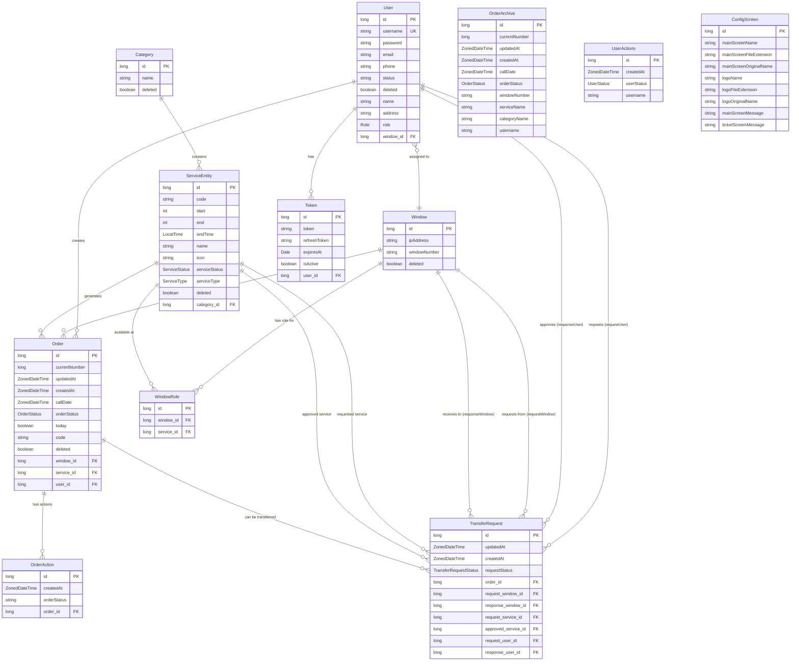

# Queue Management System

A comprehensive Spring Boot application for managing queues, services, and customer orders in a multi-window service environment.

## 📋 Table of Contents
- [Overview](#overview)
- [Entity Relationship Diagram](#entity-relationship-diagram)
- [Database Schema](#database-schema)
- [Technologies Used](#technologies-used)
- [Getting Started](#getting-started)

## 🔍 Overview

This Queue Management System is designed to handle customer service operations across multiple service windows. It provides functionality for:

- **Customer Queue Management**: Customers can create orders for specific services
- **Multi-Window Operations**: Multiple service windows can process different types of services
- **Service Categorization**: Services are organized into categories for better management
- **Order Transfer**: Orders can be transferred between windows and services
- **User Management**: Role-based access control for different user types
- **Audit Trails**: Comprehensive logging of all actions and status changes
- **Authentication**: Secure token-based authentication system

## 📊 Entity Relationship Diagram



## 🗄️ Database Schema

### Core Entities

#### **User**
Represents system users including customers, operators, and administrators.
- **Primary Key**: `id`
- **Unique Constraint**: `username`
- **Relationships**: 
  - Assigned to a Window (Many-to-One)
  - Creates Orders (One-to-Many)
  - Has authentication Tokens (One-to-Many)
  - Participates in Transfer Requests (One-to-Many)

#### **Window**
Physical service windows where customers are served.
- **Primary Key**: `id`
- **Key Fields**: `windowNumber`, `ipAddress`
- **Relationships**:
  - Processes Orders (One-to-Many)
  - Has assigned Users (One-to-Many)
  - Available for Services through WindowRole (One-to-Many)

#### **Category**
Groups related services together for better organization.
- **Primary Key**: `id`
- **Key Fields**: `name`
- **Relationships**: Contains Services (One-to-Many)

#### **ServiceEntity**
Specific services offered by the organization.
- **Primary Key**: `id`
- **Key Fields**: `code`, `name`, `serviceStatus`, `serviceType`
- **Relationships**:
  - Belongs to Category (Many-to-One)
  - Generates Orders (One-to-Many)
  - Available at Windows through WindowRole (One-to-Many)

#### **Order**
Queue tickets/orders created by customers for specific services.
- **Primary Key**: `id`
- **Key Fields**: `currentNumber`, `orderStatus`, `code`
- **Relationships**:
  - Created by User (Many-to-One)
  - Processed at Window (Many-to-One)
  - For specific Service (Many-to-One)
  - Has multiple Actions (One-to-Many)

### Supporting Entities

#### **WindowRole**
Junction table mapping which services are available at which windows.
- **Primary Key**: `id`
- **Foreign Keys**: `window_id`, `service_id`

#### **TransferRequest**
Handles transfer of orders between windows, services, or users.
- **Primary Key**: `id`
- **Complex Relationships**: Links Order, Windows, Services, and Users for transfer operations

#### **OrderAction**
Tracks status changes and actions performed on orders.
- **Primary Key**: `id`
- **Relationships**: Belongs to Order (Many-to-One)

#### **Token**
Manages user authentication and session tokens.
- **Primary Key**: `id`
- **Relationships**: Belongs to User (Many-to-One)

#### **OrderArchive**
Historical record of completed orders (denormalized for reporting).
- **Primary Key**: `id`
- **Note**: Contains flattened data for performance

#### **UserActions**
Logs user activities and status changes.
- **Primary Key**: `id`
- **Key Fields**: `userStatus`, `username`

#### **ConfigScreen**
Configuration settings for display screens and UI elements.
- **Primary Key**: `id`
- **Key Fields**: Screen and logo configuration

## 🛠️ Technologies Used

- **Framework**: Spring Boot
- **Database**: JPA/Hibernate
- **Security**: Spring Security
- **Build Tool**: Maven
- **Java Version**: 17+
- **Database**: (Configure based on your setup)

## 🚀 Getting Started

### Prerequisites
- Java 17 or higher
- Maven 3.6+
- Database (MySQL/PostgreSQL/H2)

### Installation

1. **Clone the repository**
   ```bash
   git clone <repository-url>
   cd Queue
   ```

2. **Configure Database**
   Update `application.properties` with your database configuration:
   ```properties
   spring.datasource.url=jdbc:mysql://localhost:3306/queue_db
   spring.datasource.username=your_username
   spring.datasource.password=your_password
   ```

3. **Build the Application**
   ```bash
   mvn clean install
   ```

4. **Run the Application**
   ```bash
   mvn spring-boot:run
   ```

5. **Access the Application**
   - Application will be available at: `http://localhost:8080`
   - API documentation (if Swagger enabled): `http://localhost:8080/swagger-ui.html`

### Key Features

- **Soft Delete**: Most entities implement soft deletion using the `deleted` flag
- **Audit Trail**: Comprehensive logging through OrderAction and UserActions
- **Multi-tenancy**: Support for multiple windows and services
- **Security**: Token-based authentication with refresh token support
- **Transfer System**: Advanced order transfer capabilities between windows/services
- **Archival**: Automatic archiving of completed orders for historical reporting

### Database Constraints

- **Unique Constraints**: Username must be unique across users
- **Soft Delete Filters**: Most queries automatically filter out deleted records
- **Cascade Operations**: Proper cascade configurations for data integrity
- **Temporal Data**: ZonedDateTime used for accurate timestamp handling

---

## 📝 Notes

- The system uses `@Where(clause = "deleted=false")` annotations to implement soft deletion
- All timestamps use `ZonedDateTime` for proper timezone handling
- The `OrderArchive` entity is denormalized for better reporting performance
- Transfer requests create a complete audit trail of order movements
- Window roles provide flexible service-to-window mapping

---

## 🎛️ Dashboard API

A comprehensive REST API has been created specifically for Angular dashboard frontend integration:

### **DashboardController** (`/dashboard`)

The dashboard controller provides all necessary endpoints for creating a complete administrative dashboard:

#### **Summary Statistics**
- `GET /dashboard/summary` - Complete dashboard metrics and KPIs

#### **Entity Management**
- `GET /dashboard/categories` - All categories
- `GET /dashboard/services` - All services  
- `GET /dashboard/windows` - All windows
- `GET /dashboard/users` - All users
- `GET /dashboard/orders` - All orders
- `GET /dashboard/transfer-requests` - All transfer requests

#### **Filtered Data**
- `GET /dashboard/orders/status/{status}` - Orders by status
- `GET /dashboard/services/status/{status}` - Services by status
- `GET /dashboard/users/role/{role}` - Users by role

#### **Real-time Queue Management**
- `GET /dashboard/queue/current` - Current queue status
- `GET /dashboard/queue/pending` - Pending orders
- `GET /dashboard/queue/in-progress` - Orders being processed

#### **Recent Activity**
- `GET /dashboard/recent/orders?limit=10` - Recent orders
- `GET /dashboard/recent/order-actions?limit=10` - Recent actions
- `GET /dashboard/recent/user-actions?limit=10` - Recent user activities

#### **Analytics**
- `GET /dashboard/analytics/orders-by-service` - Service performance
- `GET /dashboard/analytics/orders-by-window` - Window performance
- `GET /dashboard/analytics/orders-by-date?days=7` - Trend analysis

### **Complete API Documentation**
📄 See `DASHBOARD_API.md` for complete endpoint documentation, TypeScript interfaces, and Angular service examples.

### **Dashboard Features Supported**
- ✅ Real-time statistics and KPIs
- ✅ Entity management and monitoring
- ✅ Queue status and management
- ✅ User activity tracking
- ✅ Service performance analytics
- ✅ Transfer request monitoring
- ✅ Historical data and trends

---

**Built with ❤️ using Spring Boot**
